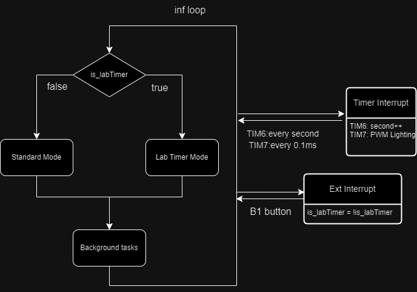
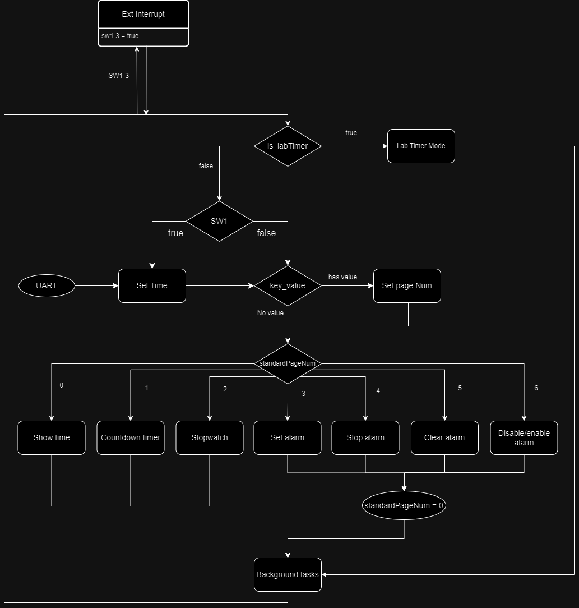
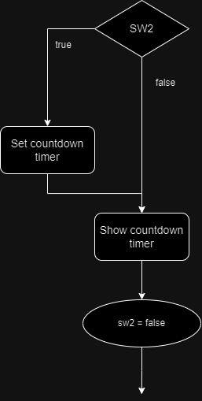
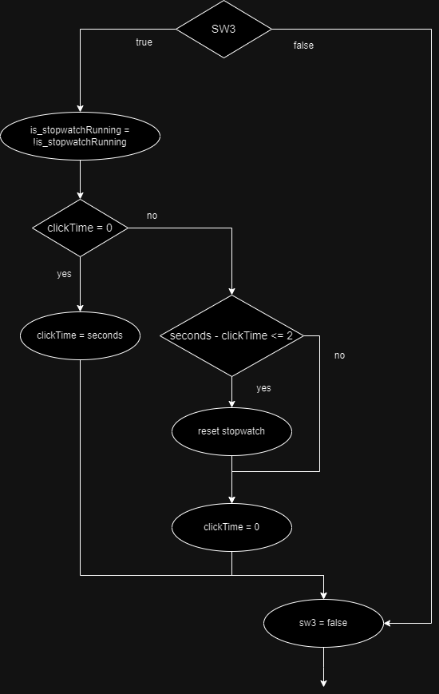
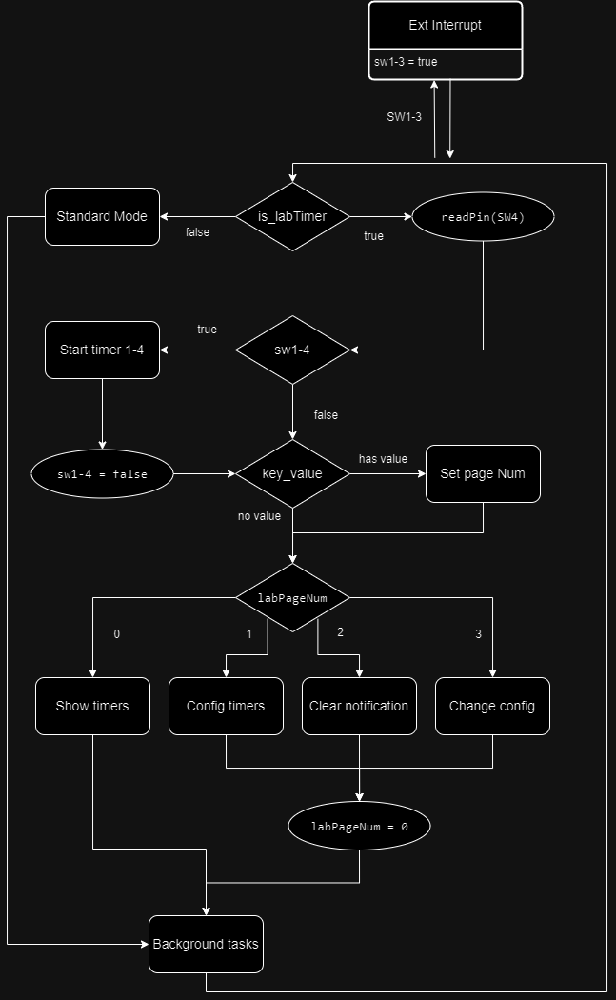
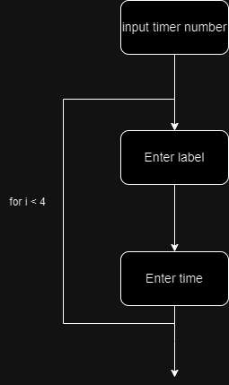
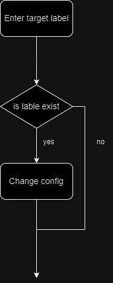

# Laboratory Timer - Developer Guide

**<h3 align="center">UNSW CSE - DESN2000 24T2</h3>**
**<p align="center">Group P</p>**
<center>Jack Wang (z5379038)</center>
<center>Aaron Shao (z5376734)</center>
<center>Rhythm Deb Nath (z5417295)</center>

---
**<h2>Project Brief</h2>**
This project is a laboratory timer, which can set at most 4 timers and can running at the same time. This timer also has a standard clock mode, which has the basic functionality as every standard clock (set alarm, countdown timer, and stopwatch).
**<h2>Develop Environment</h2>**
The following project is based on the STM32 NUCLEO-F303RE dev board extended with the UNSW DESN2000 education board designed by H.Pearce.

The LCD screen on the board is HD44780U, and the shift register that controls the LED bar is 74HC595D.

The OS used for developing this project is Windows 10

The language used for this project (on-board program) is mainly c language, with a little ARM assembly language. The platform for developing the on-board program is STM32CubeIDE with the version 1.15.1

The software for user to upload the time to the timer is written in Python language with the version of 3.12.3. The libraries used include the standard library 'time' and non-standard library 'pyserial' which you probably need to install it when testing.

The baud rate for UART is set to be 115200

To install the 'pyserial' library, you need to run the following command on your cmd terminal:

```
pip install pyserial
```
If you are under an environment with a limited permission (such as PC in company or educational institutes), you may need to use the following command:
```
pip install --user pyserial
```
Once you have run the command above, you can use following command to check whether it has been installed successfully:
```
pip show pyserial
```

**<h2>I/O Device To Microcontroller Pin Connection</h2>**
<table border="1">
    <thead>
        <tr>
            <th style="font-size: larger; font-weight: bold;">I/O Device</th>
            <th style="font-size: larger; font-weight: bold;">Microcontroller Pin</th>
            <th style="font-size: larger; font-weight: bold;">Global Variable Name</th>
        </tr>
    </thead>
    <tbody>
        <tr>
            <td style="font-size: larger; font-weight: bold;"><strong>Direct LEDs</strong></td>
            <td></td>
        </tr>
        <tr>
            <td>LED D1</td>
            <td>PB10</td>
            <td>LED_D1</td>
        </tr>
        <tr>
            <td>LED D2</td>
            <td>PB4</td>
            <td>LED_D2</td>
        </tr>
        <tr>
            <td>LED D3</td>
            <td>PB5</td>
            <td>LED_D3</td>
        </tr>
        <tr>
            <td>LED D4</td>
            <td>PB3</td>
            <td>LED_D4</td>
        </tr>
        <tr>
            <td style="font-size: larger; font-weight: bold;"><strong>Direct Buttons</strong></td>
            <td></td>
        </tr>
        <tr>
            <td>Button SW1</td>
            <td>PA1</td>
            <td>SW1</td>
        </tr>
        <tr>
            <td>Button SW2</td>
            <td>PA4</td>
            <td>SW2</td>
        </tr>
        <tr>
            <td>Button SW3</td>
            <td>PB0</td>
            <td>SW3</td>
        </tr>
        <tr>
            <td>Button SW4</td>
            <td>PC1</td>
            <td>SW4</td>
        </tr>
        <tr>
            <td style="font-size: larger; font-weight: bold;"><strong>Shift Register LEDs</strong></td>
            <td></td>
        </tr>
        <tr>
            <td>Shift Register RCLK (latch)</td>
            <td>PB7</td>
            <td>SFT_RCLK</td>
        </tr>
        <tr>
            <td>Shift Register SRCLK (serial clock)</td>
            <td>PC0</td>
            <td>SFT_SRCLK</td>
        </tr>
        <tr>
            <td>Shift Register SER (data in)</td>
            <td>PB15</td>
            <td>SFT_SER</td>
        </tr>
        <tr>
            <td style="font-size: larger; font-weight: bold;"><strong>Keypad</strong></td>
            <td></td>
        </tr>
        <tr>
            <td>ROW1</td>
            <td>PB11</td>
            <td>KEY_ROW1</td>
        </tr>
        <tr>
            <td>ROW2</td>
            <td>PB12</td>
            <td>KEY_ROW2</td>
        </tr>
        <tr>
            <td>ROW3</td>
            <td>PB13</td>
            <td>KEY_ROW3</td>
        </tr>
        <tr>
            <td>ROW4</td>
            <td>PB14</td>
            <td>KEY_ROW4</td>
        </tr>
        <tr>
            <td>COL1</td>
            <td>PA8</td>
            <td>KEY_COL1</td>
        </tr>
        <tr>
            <td>COL2</td>
            <td>PA9</td>
            <td>KEY_COL2</td>
        </tr>
        <tr>
            <td>COL3</td>
            <td>PA10</td>
            <td>KEY_COL3</td>
        </tr>
        <tr>
            <td>COL4</td>
            <td>PA11</td>
            <td>KEY_COL4</td>
        </tr>
        <tr>
            <td style="font-size: larger; font-weight: bold;"><strong>LCD</strong></td>
            <td></td>
        </tr>
        <tr>
            <td>LCD Data D4</td>
            <td>PC8</td>
            <td>LCD_D4</td>
        </tr>
        <tr>
            <td>LCD Data D5</td>
            <td>PC9</td>
            <td>LCD_D5</td>
        </tr>
        <tr>
            <td>LCD Data D6</td>
            <td>PC10</td>
            <td>LCD_D6</td>
        </tr>
        <tr>
            <td>LCD Data D7</td>
            <td>PC11</td>
            <td>LCD_D7</td>
        </tr>
        <tr>
            <td>LCD Control E</td>
            <td>PD2</td>
            <td>LCD_E</td>
        </tr>
        <tr>
            <td>LCD Control RW</td>
            <td>PC6</td>
            <td>LCD_RW</td>
        </tr>
        <tr>
            <td>LCD Control RS</td>
            <td>PA15</td>
            <td>LCD_RS</td>
        </tr>
        <tr>
            <td style="font-size: larger; font-weight: bold;"><strong>Buzzer</strong></td>
            <td></td>
        </tr>
        <tr>
            <td>PWM Input to the Buzzer</td>
            <td>PC2</td>
            <td>TIM1_CH3</td>
        </tr>
        <tr>
            <td style="font-size: larger; font-weight: bold;"><strong>LDR</strong></td>
            <td></td>
        </tr>
        <tr>
            <td>LDR R32</td>
            <td>PB1</td>
            <td>LDR_R32</td>
        </tr>
        <tr>
            <td>LDR R24</td>
            <td>PC5</td>
            <td>LDR_R24</td>
        </tr>
        <tr>
            <td style="font-size: larger; font-weight: bold;"><strong>I/O Devices on the NUCLEO Board</strong></td>
            <td></td>
        </tr>
        <tr>
            <td>Blue Button B1</td>
            <td>PC13</td>
            <td>B1</td>
        </tr>
        <tr>
            <td>LED LD2</td>
            <td>PA5</td>
            <td>LD2</td>
        </tr>
    </tbody>
</table>


**<h2>Files, Functions and Data Types</h2>**
In this project, there are several files used for implementing some useful functions and ADTs.

Here are all ADTs used in this project:

From date.h:
```c
typedef struct {
	uint32_t year;
	uint32_t month;
	uint32_t day;
    char weekday[4];
    uint32_t hour;
    uint32_t minute;
    uint32_t second;
} DateTime;

typedef struct {
	bool is_enable;
    uint32_t hour;
    uint32_t minute;
    uint32_t second;
} Alarm;
```

From timer.h:
```c
typedef struct {
	char label;
	uint32_t durationMin;
	uint32_t durationSec;
	uint32_t countDownMin;
	uint32_t countDownSec;
} Timer;
```

**DateTime**
Records the date (includes the year, month, weeks) and the time (hour, minute and second).

**Alarm**
Stores the hour, minute and second, and also a boolean to show the whether the alarm is activated. Note that this ADT is not only used for the alarm function, but also the countdown timer and stopwatch functions for the standard clock.

**Timer**
Stores the info about a timer, which includes the label, duration (minute and second), and the countdown time remains (minute and second).


---
The charts below describe the name of the functions and the useage of them:

<h3>lcd.c</h3>

| Function name | Input | Output | Functionality | Other behaviours/notes |
|---------------|-------|--------|---------------|------------------|
|`void LCD_putNibble(uint8_t data)`|the upper/lower 4-bit data|void|Used for send data/command to the LCD controller|Since the mode for LCD used for this project is 4-bit mode, you should separate the input 8-bit data into two parts and send them by calling this function twice. Note that you should send the upper 4-bit first, then send the lower 4-bit|
|`void LCD_enable()`|void|void|Enable the clock to allow the data to be read into the LCD controller|This function should be called after each call of the function LCD_putNibble(). This function has a slight delay by using while loop, to ensure the LCD controller has read the command correctly|
|`void LCD_command(uint8_t command)`|the entire 8-bit COMMAND to control the behaviour of the LCD|void|To send the command to the LCD controller|The available command can be found in the user menu of HD44780U|
|`void LCD_data(uint8_t data)`|the entire 8-bit DATA to be displayed on the screen|void|To display the input data, which is a single charactor|The available input data can be found in the user menu of HD44780U|
|`void LCD_display(const char *str)`|string with the length no more than 32|void|To display the input string on the screen|When the string is longer than 16, the rest of the string will show in the next line|
|`void LCD_Timedisplay(const char *str)`|string with the length no more than 32|void|Only used to display the date and time||
|`void LCD_init()`|void|void|Initialize the LCD controller|Should be and is used at the Init part of the project|

<h3>keyPad.c</h3>

| Function name | Input | Output | Functionality | Other behaviours/notes |
|---------------|-------|--------|---------------|------------------|
|`uint8_t KEY_scan(uint16_t *cols, uint16_t *rows)`|array of the col pins and row pins for keypad|The key value for the key that is being pressed. If no key is pressed, it will return 0||

<h3>buzzer.c</h3>

| Function name | Input | Output | Functionality | Other behaviours/notes |
|---------------|-------|--------|---------------|------------------|
|`void generate_sound(int frequency, TIM_HandleTypeDef htim1)`|the frequnce of the sound (int) and the TIM handler for hardware PWM for buzzer|void|To generate the sound of the given frequence||
|`void stop_sound(TIM_HandleTypeDef htim1)`|TIM handler for hardware PWM for buzzer|void|Stop the sound||

<h3>delay.s</h3>

| Function name | Input | Output | Functionality | Other behaviours/notes |
|---------------|-------|--------|---------------|------------------|
|`extern void delay(uint32_t seconds)`|the second to delay|void|To delay the given amount of seconds|This function is the only function written in ARM assembly language|

<h3>date.c</h3>

| Function name | Input | Output | Functionality | Other behaviours/notes |
|---------------|-------|--------|---------------|------------------|
|`DateTime setDefaultTime()`|void|new DateTime with default time|Set the default time for the system|The default time is set to be the starting date of the project|
|`void timeToStr(char *strTime, DateTime time)`|String and DateTime|void|to transfer and store the given DateTime into the given string with the format "yyyy-mm-dd Week hh:mm:ss"||
|`void strToDateTime(const char *str, DateTime *dt)`|String and a pointer of the DateTime|void|To tansfer and store the given string that stores the date and time (format same as above) into the given pointer of the DateTime||
|`DateTime updateTime(DateTime dt, uint32_t elapsedSeconds)`|a DateTime and the running time (in seconds) of the timer|updated DateTime|To update the given DateTime by the given seconds||
|`Alarm setAlarm(Alarm alarm, uint32_t hour, uint32_t minute, uint32_t second)`|alarm, hour, minute and second|alarm|to set the alarm of the given time and enable it||
|`Alarm changeAlarmState(Alarm alarm)`|alarm|alarm|to disable/enable the alarm depends on the current state of the given alarm||
|`bool isSameTime(Alarm alarm, DateTime dt)`|alarm and DateTime|boolean|to show if the given alarm has the same time as the given DateTime. Returns true if same||
|`bool isFinishCountDown(Alarm countdown)`|countdown timer|boolean|to show if the given countdown timer is finished. Returns true if it is finished||
|`bool isAlarmEnabled(Alarm alarm)`|alarm|boolean|to show whether the given alarm is enabled. Returns true if it is enabled||
|`static int isLeapYear(int year)`|year (int)|1 or 0 (int)|helper function to determine if the given year is a leap year. If it is leap year, return 1. Else return 0||
|`static int getDaysInMonth(int year, int month)`|year (int), month (int)|days of given month in the given year|Get the number of days in a given month in the given year||

<h3>timer.c</h3>

| Function name | Input | Output | Functionality | Other behaviours/notes |
|---------------|-------|--------|---------------|------------------|
|`Timer setLabTimer(Timer timer, char label, uint32_t second, uint32_t minute)`|lab timer, timer label, second, minute|timer|Set the given timer with the given label and amount of time|This function will initialize the countdown time to be 0, so it won't start immediately after the initialization|
|`void showLabTimer(Timer *timer)`|Array of timers|void|to display all timers (both initialized and uninitialized) on the LCD screen|The format of each timer is "l mm:ss", where 'l' is the label of the timer|
|`void *updateLabTimer(Timer *timer, uint32_t seconds, uint32_t *lastSecond, bool *timer1, bool *timer2, bool *timer3, bool *timer4, TIM_HandleTypeDef htim1)`|Array of timers, system running seconds, last updated system running seconds, booleans that shows whether the corresponding timer is finished, timer interrupt handler 1 (for buzzer)|void|to update the timers (initialized) in the given array of timers if last second is not same as the second now and the countdown time is not 0. If a timer is finished countdown, the corresponding boolean will set to be true, and will generate a notification from buzzer for 0.5s|After the change, the lastSecond will be set to the second of the given running second|
|`bool isFinishedLabTimer(Timer timer)`|timer|boolean|to check whether the given timer is finished. Returns true if it is finished||

<h3>standardClock.c</h3>

| Function name | Input | Output | Functionality | Other behaviours/notes |
|---------------|-------|--------|---------------|------------------|
|`void standardClock(uint32_t *lastSecond, uint32_t seconds, DateTime baseTime, DateTime *currentTime)`|last updated system running seconds, system running seconds, baseTime (DateTime), pointer of currentTime (DateTime)|void|display the given currentTime on LCD screen and update the currentTime with the given amount of running seconds|After the change, the lastSecond will be set to be the second of the given running second|
|`void standardTimerShow(Alarm countdown, char *str)`|countdown timer/stopwatch (Alarm), string|void|to transfer the given Alarm variable into string (format: "hh:mm:ss"), and then display the tranferred string on the LCD screen. The passed string is to show which functionality the LCD is currently showing. For example, if it's showing the countdown timer, the string content should be "Countdown"||
|`Alarm userSetAlarm(Alarm alarm)`|alarm|alarm|set the alarm time according to the user inputs||
|`Alarm countDownUpdate(Alarm countDownTimer, uint32_t seconds, uint32_t *lastSecond, TIM_HandleTypeDef htim1)`|countdown timer (Alarm), system running seconds, last updated system running seconds, TIM handler for buzzer|countdown timer (Alarm)|to update the countdown timer. Once the countdown timer is finished, it will generate a notification||
|`Alarm stopwatchUpdate(Alarm stopwatch, uint32_t seconds, uint32_t *lastSecond)`|stopwatch (Alarm), system running seconds, last updated system running seconds|stopwatch (Alarm)|update the given stopwatch by one second||
|`static bool setAlarmTimeNum(uint32_t *time, uint32_t maxTime)`|pointer of the time (uint32_t*), maximum time|boolean to show whether there is an invalid input by user|to set the alarm time||


**<h2>Project Structure</h2>**
**<h3>Main Loop</h3>**


**Global variables used for the entire system:**
```c
volatile uint32_t seconds = 0;

bool is_labTimer = false;
bool is_labTimerBefore = true;
```
<table border="1">
    <thead>
        <tr>
            <th style="font-size: larger; font-weight: bold;">Global Variable</th>
            <th style="font-size: larger; font-weight: bold;">Purpose</th>
            <th style="font-size: larger; font-weight: bold;">Behaviour</th>
        </tr>
        <tbody>
            <tr>
                <td>seconds</td>
                <td>Record the system time once the timer is started</td>
                <td>Changed every second by the timer interrupt TIM6</td>
            </tr>
            <tr>
                <td>is_labTimer</td>
                <td>To indentify which mode of the timer should be</td>
                <td>Changed to the opposite value once the B1 button is pressed</td>
            </tr>
            <tr>
                <td>is_labTimerBefore</td>
                <td>To clear the LCD screen which is showing the info from the other mode</td>
                <td>This variable will always be NOT(is_labTimer)</td>
            </tr>
        </tbody>
    </thead>
</table>

---
**<h3>Standard Mode</h3>**


Global variables:
```c
DateTime baseTime;
DateTime currentTime;
Alarm alarm;
Alarm countDownTimer;
Alarm stopWatch;

int standardPageNum = 0;
bool sw1 = false;
bool sw2 = false;
bool sw3 = false;
bool sw4 = false;
bool is_stopwatchRunning = false;
uint32_t clickTime = 0;
```

<table border="1">
    <thead>
        <tr>
            <th style="font-size: larger; font-weight: bold;">Global Variable</th>
            <th style="font-size: larger; font-weight: bold;">Purpose</th>
            <th style="font-size: larger; font-weight: bold;">Behaviour</th>
        </tr>
        <tbody>
            <tr>
                <td>baseTime</td>
                <td>Stores the base time of the system</td>
                <td>Set to be the default value at the initialization stage, and can be changed when sw1 is true</td>
            </tr>
            <tr>
                <td>currentTime</td>
                <td>Stores the current time of the system</td>
                <td>Can be obtained by the baseTime + seconds (system running time), updated in every second</td>
            </tr>
            <tr>
                <td>alarm</td>
                <td>Store the alarm info</td>
                <td>Should not be changed once it is configured, and will be compared to the currentTime. Once they are matched and if alarm is enabled, the timer will rise an alert</td>
            </tr>
            <tr>
                <td>countDownTimer</td>
                <td>Store the countdown timer info</td>
                <td>This variable is changed in every second once it has been set.</td>
            </tr>
            <tr>
                <td>stopWatch</td>
                <td>Store the stopwatch info</td>
                <td>This variable is changed in every second once the sw3 is true. And if sw3 is set to be true again, this variable will stop to update. And if SW3 (button) is inserted twice within 2 seconds, it will be reset to 0</td>
            </tr>
            <tr>
                <td>standardPageNum</td>
                <td>This variable stores the current page number of the standard mode is on</td>
                <td>This variable is changed by pressing certain keys on the keypad (will be explained later on)</td>
            </tr>
            <tr>
                <td>sw1-4</td>
                <td>These variables stores the boolean value to show which SW has been inserted, and hence to make the behaviour according to which SW is pressed as well as which mode is on</td>
                <td>Will set to be true when the corresponding SW is inserted (e.g. if SW1 is inserted, then sw1 will set to be true)</td>
            </tr>
            <tr>
                <td>is_stopwatchRunning</td>
                <td>To indentify whether the stopwatch is running</td>
                <td>Initially set to be false. Once the sw3 is true, it will set to be NOT(is_stopwatchRunning)</td>
            </tr>
            <tr>
                <td>clickTime</td>
                <td>To record the click time of the SW3 and then can use this time to check whether the SW3 is double clicked within 2 seconds</td>
                <td>By default, this value is set to be 0. Once sw3 is set to be true, this variable will record the current system running second, and will use this value to compare with current running second when the sw3 is set to be true again. Then, the value of this variable will set to be 0 again</td>
            </tr>
        </tbody>
    </thead>
</table>

***Here, DateTime and Alarm are ADTs defined at the header file "date.h"***

The following chart is the relationship between the key value and page number in the standard mode

|key value|standard page number|
|---------|--------------------|
|'#'|standardPageNum++ (if larger than 2, then set back to 0)|
|'*'|standardPageNum-- (if less than 0, set back to 2)|
|'A'|standardPageNum = 3|
|'B'|standardPageNum = 4|
|'C'|standardPageNum = 5|
|'D'|standardPageNum = 6|

Under Standard mode, there are some submodes which are selected by the standardPageNum:

**0: Show time**

Simply done by calling standardClock function described above

**1: Countdown timer**



**2: Stopwatch**



**3: Set alarm**

```c
alarm = userSetAlarm(alarm);
standardPageNum = 0;
```

**4: Stop alarm**

```c
HAL_TIM_PWM_Stop(&htim1, TIM_CHANNEL_3);
standardPageNum = 0;
```

**5: Clear alarm**

```c
alarm = setAlarm(alarm, 25, 61, 61);
HAL_TIM_PWM_Stop(&htim1, TIM_CHANNEL_3);
LCD_command(0b00000001);
LCD_display("Alarm is cleared");
delay(1000);
LCD_command(0b00000001);
standardPageNum = 0;
```

**6: Disable/enable alarm**

```c
alarm = changeAlarmState(alarm);
LCD_command(0b00000001);
if (!isAlarmEnabled(alarm)) {
    LCD_display("Alarm disabled");
} else {
    LCD_display("Alarm enabled");
}
delay(500);
LCD_command(0b00000001);
standardPageNum = 0;
```

---
**<h3>Lab Timer Mode</h3>**


Global variables:
```c
bool sw1 = false;
bool sw2 = false;
bool sw3 = false;
bool sw4 = false;

int timerNum = 0;
Timer timers[4];

int labPageNum = 0;
```

<table border="1">
    <thead>
        <tr>
            <th style="font-size: larger; font-weight: bold;">Global Variable</th>
            <th style="font-size: larger; font-weight: bold;">Purpose</th>
            <th style="font-size: larger; font-weight: bold;">Behaviour</th>
        </tr>
        <tbody>
            <tr>
                <td>sw1-4</td>
                <td>These variables stores the boolean value to show which SW has been inserted, and hence to make the behaviour according to which SW is pressed as well as which mode is on</td>
                <td>Will set to be true when the corresponding SW is inserted (e.g. if SW1 is inserted, then sw1 will set to be true)</td>
            </tr>
            <tr>
                <td>timerNum</td>
                <td>To record the number of timers</td>
                <td>Initially set to be 0 and will be updated during timer configuration by the user input</td>
            </tr>
            <tr>
                <td>timers[4]</td>
                <td>Stores the timers (both initialized and uninitialized)</td>
                <td>Initially set to be empty and will be updated during timer configuration by the user input</td>
            </tr>
            <tr>
                <td>labPageNum</td>
                <td>This variable stores the current page number of the lab mode</td>
                <td>This variable is changed by pressing certain keys on the keypad (will be explained later on)</td>
            </tr>
        </tbody>
    </thead>
</table>

***Here, the type Timer is defined at the header file "timer.h"***

The following chart is the relationship between the key value and page number in the lab mode

|key value|Lab page number|
|---------|--------------------|
|None|labPageNum = 0|
|'A'|labPageNum = 1|
|'B'|labPageNum = 2|
|'C'|labPageNum = 3|

Same as the standard mode, there are also some submodes in the lab mode which are selected by labPageNum.

**0: Show timers**

```c
showLabTimer(timers);
```

**1: Config timers**



**2: Clear notification**

```c
timer1 = false;
timer2 = false;
timer3 = false;
timer4 = false;
labPageNum = 0;
```

**2: Change config**



---
**<h3>Background Tasks</h3>**

There are 5 background tasks in this project, which is implemented at the end of the entire while loop (see Main Loop). These tasks is just to ensure some functionality can still work under the different mode (e.g. lab timer should still running under standard mode).

**LED bar control**

The LED bar is controlled by the value read from the LDR_R24. The value is then fed into a simple digital filter (Exponential Moving Average Filer) for a smooth change of dutycycle value.

```c
float alpha = 0.0001;
static float ema = 0;

HAL_ADC_Start(&hadc2);
HAL_ADC_PollForConversion(&hadc2, 1);
ldrValue = HAL_ADC_GetValue(&hadc2);

// Exponential Moving Average Filter
ema = alpha * ldrValue + (1 - alpha) * ema;

if (ema >= 600) {
    dutycycle = 0;
} else if (ema <= 100) {
    dutycycle = 100;
} else {
    dutycycle = (600 - (uint32_t)ema) / 5;
}
```

For the code above, ema is stand for Exponential Moving Average, which is the current exponential moving average value. Alpha is the smoothing factor, and it should between 0 and 1. The closer to 0 the Alpha is, the smoother output value will be obtained.

For generating PWM signal, we choose to use the software PWM to control the brightness of the LED bar. In order avoid using delay functions inside the main loop, we choose to use another timer interrupt to control the PWM. 

The timer interrupt number is TIM7, it will create a system interrupt every 0.1 seconds. The period for PWM is set to be 10ms, and hence we will have 100 interrupts within this period. Below is the logic inside the TIM7 interrupt:

```c
if (mseconds >= 100) {
    mseconds = 0;
} else {
    mseconds++;
}

// use software PWM to control shift LEDs
if (mseconds == dutycycle) {
    /*turn off the LED bar*/
} else if (mseconds == 0) {
    /*turn on the LED bar*/
}
```

**Countdown timer update**

```c
countDownTimer = countDownUpdate(countDownTimer, seconds, &lastSecondStandardCountdown, htim1);
```

**Lab timer update**

```c
updateLabTimer(timers, seconds, &lastSecondLabTimer, &timer1, &timer2, &timer3, &timer4, htim1);
```

**System time update**

```c
currentTime = updateTime(baseTime, seconds);
```

**Stopwatch update**

```c
if (is_stopwatchRunning) {
    stopWatch = stopwatchUpdate(stopWatch, seconds, &lastSecondStopwatch);
}
```

**<h2>Other Resource</h2>**

There is a very simple Python file for uploading the time to the timer. Since it is very simple, the code is attached below for referencing and further development:

```py
import serial
import time

user_port = input("Enter Serial Port (For example: COM5): ")

ser = serial.Serial(
    port= user_port,
    baudrate=115200,
    parity=serial.PARITY_NONE,
    stopbits=serial.STOPBITS_ONE,
    bytesize=serial.EIGHTBITS,
    timeout=1
)

current_time = time.strftime('%Y-%m-%d %a %H:%M:%S', time.localtime())
current_time = current_time + '\n'
print(current_time)

ser.write(current_time.encode('utf-8'))
```

The program above is just simply read the port from the user. Then, create an instance of serial communication. And then get the localtime from user's PC or Laptop, and transfer into the format: '%Y-%m-%d %a %H:%M:%S' and add '\n' at the end to ensure the timer can receive the string correctly. When these are all done, this program will send the string through the connected serial port.

Note that, when you are using/developing the Python program above, you should better to use the same environment as what the Develop Environment section described. 
